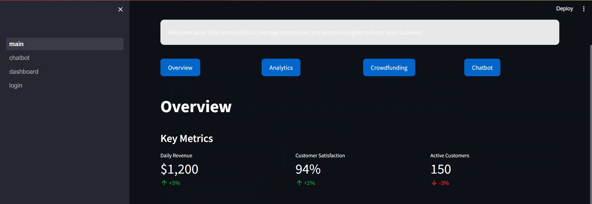
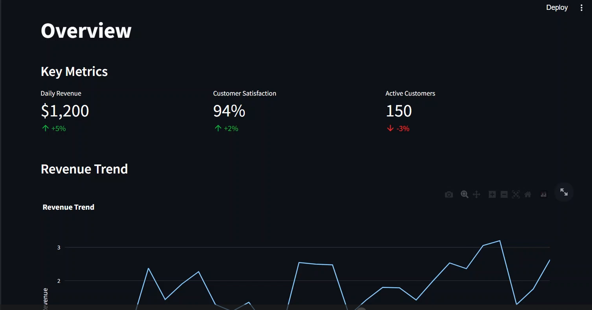
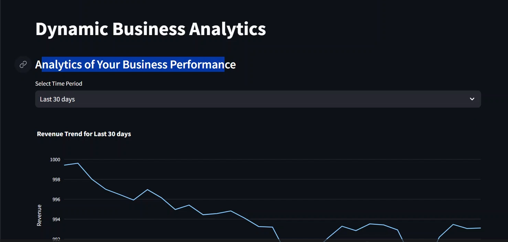
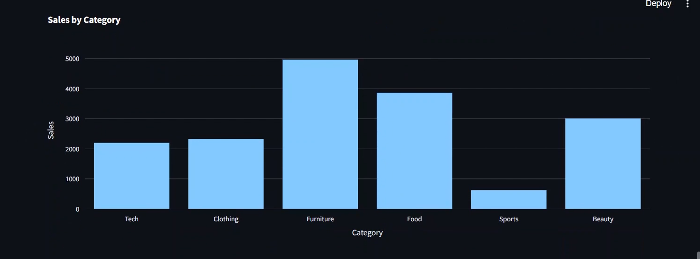
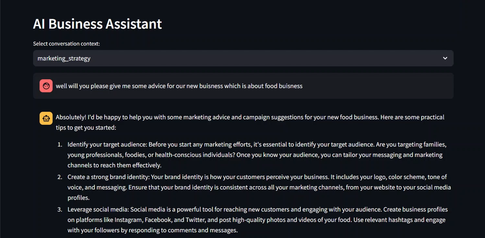

# AI Small Business Assistant Chatbot 🤖

Welcome to the **AI Small Business Assistant Chatbot**!  
This project is an interactive chatbot built with [Streamlit](https://streamlit.io/) to help small business owners with daily tasks, planning, and decision-making using AI.

## Features

- 💬 **Conversational AI**: Get instant answers to your business questions.
- 🗂️ **Task Automation**: Automate routine business tasks and get recommendations.
- 🔒 **API Key Authentication**: Secure access to advanced AI features.
- 📊 **Business Insights**: Receive tips and insights tailored to your business needs.
- 🌐 **Easy-to-use Interface**: Clean, modern UI powered by Streamlit.

## Demo
<p align="center"></p>
<p align="center"></p>
<p align="center"></p>
<p align="center"></p>
<p align="center"></p>
<p align="center"></p>
<p align="center"></p>


## Getting Started

### Prerequisites

- Python 3.8+
- [Streamlit](https://streamlit.io/)
- API key for your chosen AI provider (e.g., OpenAI, Cohere, etc.)

### Installation

1. **Clone the repository:**
    ```sh
    git clone https://github.com/yourusername/ai-small-business-assistant.git
    cd ai-small-business-assistant
    ```

2. **Install dependencies:**
    ```sh
    pip install -r requirements.txt
    ```

3. **Set your API key:**
    - Create a `.env` file in the project root:
        ```
        API_KEY=your_api_key_here
        ```
    - Or set the environment variable in your terminal:
        ```sh
        export API_KEY=your_api_key_here
        ```

4. **Run the app:**
    ```sh
    streamlit run app.py
    ```

## Usage

- Enter your business questions or tasks in the chat interface.
- The assistant will respond with helpful answers, suggestions, or actions.
- Use the sidebar to configure preferences or manage your API key.

## Project Structure
